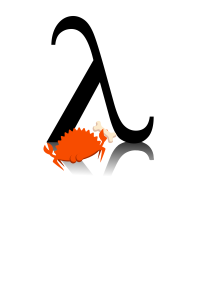

<div align="left">
    
</div>

# Scheme-rs: Embedded Scheme for the Async Rust Ecosystem

Scheme-rs is a work-in-progress implementation of the [R6RS](https://www.r6rs.org/final/r6rs.pdf) specification
of the scheme programming language that is designed to work with async Rust runtimes like [tokio](https://tokio.rs/).
In essence, it is a embedded scripting language for the async Rust ecosystem.

Scheme-rs is intended to be fully compliant with R6RS, and R7RS large when it is eventually released. To that end
the bones are mostly there but some key issues remain. 

Eventually, I would like scheme-rs to be more opinionated in the extras it provides, and include a package manager.
That is obviously a long way away.

## Features currently supported by scheme-rs:

- Tail-call optimizations are fully supported 
- Garbage Collected via [Bacon-Rajan Concurrent Cycle Collection](https://pages.cs.wisc.edu/~cymen/misc/interests/Bacon01Concurrent.pdf)
- Most key forms (let/let*/define)
- Call by current continuation
- Transformers 
- Spawning tasks and awaiting futures

## Features currently unsupported by scheme-rs: 

- Records, and therefore conditions and error handling
- Ports and IO operations
- Generally, most API functions are not currently implemented
- set-car! and set-cdr!
- A large portion of lexical structures are missing; there's no way to specify recursive data structures
- Let loop
- And many more that I cannot think of off the top of my head.

## Usage:

### Running a REPL:

A REPL is the default entry point for scheme-rs at the current moment. You can access it by running `cargo run`
in the repo's root directory:

```
~/scheme-rs> cargo run
    Finished `dev` profile [unoptimized + debuginfo] target(s) in 0.03s
     Running `target/debug/scheme-rs`
>>> (+ 5 5)
$1 = 10
```

### Creating Builtin Functions:

Scheme-rs provides a `builtin` function attribute macro to allow you to easily define builtins. For example,
here is the definition of the `number?` builtin in the source code:

```rust
#[builtin("number?")]
pub async fn is_number(
    _cont: &Option<Arc<Continuation>>,
    arg: &Gc<Value>,
) -> Result<Gc<Value>, RuntimeError> {
    let arg = arg.read().await;
    Ok(Gc::new(Value::Boolean(matches!(&*arg, Value::Number(_)))))
}
```

## Why not just use Guile?

In the end, it all comes down to [call with current continuation](https://en.wikipedia.org/wiki/Call-with-current-continuation). Guile implements this feature by copying the stack, an action which is obviously problematic when considering 
ref counts and locks. Scheme-rs remedies this by providing all functions with the current continuation so that they
may handle it properly. Additionally, the current continuation only contains references and not locked variables. 
