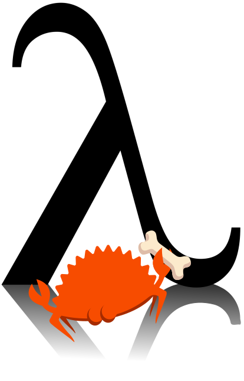

# <picture><source media="(prefers-color-scheme: dark)" srcset="logo-dark.png"></picture> Scheme-rs: Embedded R6RS Scheme for the Rust Ecosystem

Scheme-rs is a work-in-progress implementation of the [R6RS](https://www.r6rs.org/final/r6rs.pdf) specification
of the scheme programming language that is designed to embedded within sync and  async Rust

In essence, it is a embedded scripting language for the Rust ecosystem.

Scheme-rs is intended to be fully compliant with R6RS, and R7RS large when it is eventually released. To that end
the bones are mostly there but some key issues remain. 

Eventually, I would like scheme-rs to be more opinionated in the extras it provides, and include a package manager.
That is obviously a long way away.

## Features currently supported by scheme-rs:

- Tail-call optimizations are fully supported 
- Concurrent garbage collection via [Bacon-Rajan Concurrent Cycle Collection](https://pages.cs.wisc.edu/~cymen/misc/interests/Bacon01Concurrent.pdf)
- All key forms
- Call-by-current-continuation
- Delimited continuations (`call-with-prompt`, `abort-to-prompt`)
- Hygienic macros and syntax transformers (`define-syntax`, `syntax-case`, `datum->syntax` and `syntax->datum`) 
- Spawning tasks and awaiting futures
- Exceptions and error handling (`raise`, `raise-continuable`, `with-exception-handler`)
- `dynamic-wind`
- Defining sync/async bridge functions in Rust and importing Rust types into Scheme
- Records and conditions
- Hashtables
- Libraries and all import forms

## Features currently in development

- File I/O API for ports

## Usage:

### Running a REPL:

A REPL is the default entry point for scheme-rs at the current moment. You can access it by running `cargo run`
in the repo's root directory (examples taken from wikipedia):

```
~/scheme-rs> cargo run
    Finished `dev` profile [unoptimized + debuginfo] target(s) in 0.03s
     Running `target/debug/scheme-rs`
> (let loop ((n 1))
   (if (> n 10)
       '()
       (cons n
         (loop (+ n 1)))))
$1 = (1 2 3 4 5 6 7 8 9 10)
> (let* ((yin
            ((lambda (cc) (display "@") cc) (call-with-current-continuation (lambda (c) c))))
         (yang
            ((lambda (cc) (display "*") cc) (call-with-current-continuation (lambda (c) c)))))
     (yin yang))
@*@**@***@****@*****@******@*******@********@*********@**********@***********@**********...^C
```

### Installing the CLI

The REPL CLI can be installed via navigating to the scheme-rs repository root and running:

```console
$ cargo install --path .
```

To enable scheme-rs's async features, install with the `tokio` and `async` feature flags:

```console
$ cargo install --path . --features "tokio,async"
```

scheme-rs embeds all of its libraries within its executable, so the binary is all you need
to run scheme programs.

## Embedding 

Scheme-rs can be embedded into any Rust application. 

### Feature flags

Scheme-rs supports both sync and async contexts. By default scheme-rs is sync, but can be made async
via the `tokio` and `async` feature flags. 

### Creating bridge Functions:

Scheme-rs provides a `bridge` function attribute macro to allow you to easily define builtins. The 
following example defines the numeric equal function and includes it in the `(rnrs base builtins (6))` 
library:

```rust
#[bridge(name = "=", lib = "(rnrs base builtins (6))")]
pub fn equal_builtin(args: &[Value]) -> Result<Vec<Value>, Exception> {
    if let Some((first, rest)) = vals.split_first() {
        let first: Arc<Number> = first.clone().try_into()?;
        for next in rest {
            let next: Arc<Number> = next.clone().try_into()?;
            if first != next {
                return Ok(vec![Value::from(false)]);
            }
        }
    }
    Ok(vec![Value::from(true)])
}
```

If the `tokio` and `async` feature flags are enabled, bridge functions can be async:

```rust
#[bridge(name = "sleep", lib = "(tokio)")]
pub async fn sleep(seconds: &Value) -> Result<Vec<Value>, Exception> {
    use tokio::time::{sleep, Duration};

    let seconds: Arc<Number> = seconds.clone().try_into()?;
    let seconds: usize = seconds.as_ref().try_into()?;

    sleep(Duration::from_millis(100)).await;

    Ok(Vec::new())
}
```

### Embedding Rust types in Scheme

Any Rust type that can implement `Trace` can be converted in to a Scheme value by 
implementing the `SchemeCompatible` trait:

```rust
#[derive(Copy, Clone, Default, Debug, Trace)]
pub struct SimpleCondition;

impl SimpleCondition {
    pub fn new() -> Self {
        Self
    }
}

impl SchemeCompatible for SimpleCondition {
    fn rtd() -> Arc<RecordTypeDescriptor> {
        rtd!(name: "&condition")
    }
}
```


## Implementation details:

`scheme-rs` is JIT compiled, compiling the expanded Scheme code into a [CPS](https://en.wikipedia.org/wiki/Continuation-passing_style) 
mid-level IR, and then converting that into Cranelift IR.

At present the code produced by `scheme-rs` is of pretty poor quality. Very few optimizations are performed, all variables 
are boxed. Focus was spent on making this project as correct as possible, and to that end this is a JIT compiler for 
scheme that fully supports syntax-case, proper tail recursion, and interaction with async Rust. Contributions are more than
welcome if you would like to add optimizations passes to the compiler.


## Contributing

If you have any questions or comments about the project, feel free to join [the scheme-rs discord server here](https://discord.gg/sR4TttzGv5).
