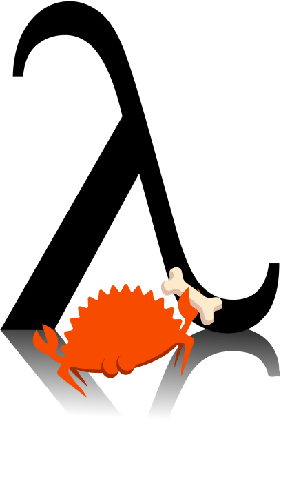

<figure markdown="span">
    <picture><source media="(prefers-color-scheme: dark)" srcset="images/logo-dark.png"></picture> 
</figure>

# Scheme-rs: Embedded Scheme for the Rust Ecosystem
[](https://github.com/maplant/scheme-rs)
[](https://crates.io/crates/scheme-rs)
[](https://docs.rs/scheme-rs)

Scheme-rs is an implementation of the
[R6RS](https://www.r6rs.org/final/r6rs.pdf) specification of the [Scheme programming 
language](https://en.wikipedia.org/wiki/Scheme_(programming_language)) that is 
designed to embedded within sync and async Rust. 

``` scheme
;; Example of a program that defines a variable via a datum received over a 
;; socket.
;; 
;; Requires the `async` and `tokio` features enabled.

(import (rnrs) (async))

(define-syntax expand-from-socket
  (lambda (x)
    (syntax-case x ()
      [(ctxt)
       (let ([listener (bind-tcp "0.0.0.0:8080")])
         (let-values ([(port addr) (accept listener)])
           (let* ([port (transcoded-port port (native-transcoder))]
                  [recvd-syntax (datum->syntax #'ctxt (get-datum port))])
             (write 'thanks! port)
             (close-port port)
             recvd-syntax)))])))

(define var-from-network (expand-from-socket))
```

## Features:

- **Modern**: scheme-rs is a modern scheme implementation of the R6RS standard and includes 
  advanced features such as [delimited continuations](https://en.wikipedia.org/wiki/Delimited_continuation).
- **Fast**: scheme-rs uses JIT compilation to provide performance on par with 
  other modern scheme implementations.
- **Easy to use**: scheme-rs makes it trivial to define Rust functions and data
  structures that are accessible from scheme code and vice-versa.
- **Safe**: scheme-rs provides a completely safe API that is impossible to 
  misuse.
- **Supports both async and sync Rust**: by enabling the `async` feature flag 
  it becomes possible (and easy) to define async scheme functions in Rust. 

## Getting started:

For embedding scheme-rs in your Rust project, [take a look at the API documentation](https://docs.rs/scheme-rs/latest/scheme_rs/).

For installing scheme-rs as a standalone executable, cargo can be used:

``` console
$ cargo install scheme-rs 
```

To enable async features, install with the `async` and `tokio` features:

``` console
$ cargo install scheme-rs --features "async,tokio"
``` 

## Documentation 

- [API documentation](https://docs.rs/scheme-rs/latest/scheme_rs/)
- [Language reference](<./Language Reference/>)

## Contributing

If you have any questions or comments about the project, feel free to join 
[the scheme-rs discord server](https://discord.gg/sR4TttzGv5).


